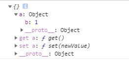
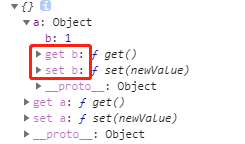

# 手写vue核心原理

## 一.使用Rollup搭建开发环境

### 1.1 什么是Rollup?

Rollup是一个js模块打包器，可以将小块代码编译成大块复杂的代码，rollup.js更专注于js类库打包(开发应用时使用webpack，开发库是使用rollup)。

### 1.2 环境搭建

安装的npm包有:

```Bash
npm install rollup
rollup-plugin-babel # 将rollup和babel关联起来
@babel/core # babel核心包
@babel/preset-env # es6转成es5
rollup-plugin-serve # rollup本地服务器
```

在rollup的默认配置文件rollup.config.js中配置：

```js
import babel from 'rollup-plugin-babel';
import serve from 'rollup-plugin-serve';

export default {
  // 定义入口文件
  input: './src/index.js',
  output: {
    format: 'umd', // 定义模块化类型(支持esModule commonjs umd)
    name: 'Vue', // 打包后全局变量的名字
    file: 'dist/umd/vue.js', // 输出文件名
    sourcemap: true, // 转换后代码和转换前代码作映射表，可以调试转换后的代码
  },
  // 插件
  plugin: [
    // babel编译
    babel({
      exclude: 'node_modules/**', // 排除目录
    }),
    // 配置的服务器
    serve({
      port: 3000,
      contentBase: '',
      openPage: '/index.html'
    })
  ]
}
```

入口文件src/index.js export一个fn函数:

```js
export const fn = () => {
}
```

打包后的dist/umd/vue.js源码：

```
(function (global, factory) {
  typeof exports === 'object' && typeof module !== 'undefined' ? factory(exports) :
  typeof define === 'function' && define.amd ? define(['exports'], factory) :
  (global = typeof globalThis !== 'undefined' ? globalThis : global || self, factory(global.Vue = {}));
}(this, (function (exports) { 'use strict';

  const fn = () => {
    
  };

  exports.fn = fn;

  Object.defineProperty(exports, '__esModule', { value: true });

})));
//# sourceMappingURL=vue.js.map
```

从源码里面可以看到global.vue={}为工厂函数factory的参数，这是rollup里面配置的`output: {name: 'Vue'}`作用的结果，在浏览器中则可以直接访问到Vue。

package.json配置下面命令：
```bash
# -c使用配置文件rollup.config.js  -w监听更新
"scripts": {
  "dev": "rollup -c -w"
},
```

index.html:

```
<script src="dist/umd/vue.js"></script>
<script>
  console.log(Vue);
</script>
```

运行npm run dev可看到浏览器中输出`console.log(Vue)`结果为fn函数：

```
{ fn: () => { } }
```

# 二.Vue响应式原理

### 2.1 初始化状态时进行数据初始化劫持

在Vue中，我们都知道Vue的数据响应式：当数据发生变化，视图就会更新；所以在初始化状态的时候，需要将数据做一个初始化劫持；所谓的数据劫持，也就是当改变数据的时候应该更新视图。

<b>初始化架构：</b>

在src/index.js中，创建Vue类，并且调用插件initMixin中的初始化_init方法，传入vue实例的配置项。

vue实例为：

```js
const vm = new Vue({
  el: '#app',
  data() {
    return {
      a: '响应式数据原理'
    }
  }
});
```
入口文件：
```js
import { initMixin } from "./init";

// Vue类用构造函数写法
function Vue(options) {
  // 调用initMixin插件里面的_init原型方法
  this._init(options);
}

// 原型方法写成插件的形式便于模块化
initMixin(Vue);

export default Vue;
```

在initMixin插件的_init原型方法中，初始化状态。(src/init.js)

```js
import { initState } from "./state";

export function initMixin(Vue) {
  Vue.prototype._init = function (options) {
    // 将配置项挂载到实例vm上：vm.$options就可以访问配置项
    const vm = this;
    vm.$options = options;
    // 初始化状态
    initState(vm);
  }
}
```

在初始化状态initState(vm)中，将配置项中传入的data进行数据劫持。(src/state.js)

```js
import { observe } from "./observer/index";

export function initState(vm) {
  const opts = vm.$options;
  // 响应式数据原理和数据相关
  // 数据初始化劫持
  if (opts.data) {
    initData(vm);
  }
}

const initData = (vm) => {
  let data = vm.$options.data;
  // data可以是函数、对象，下面处理后得到对象
  data = typeof data === 'function' ? data.call(vm) : data;
  // 将data放到实例vm上外部可以通过vm._data访问到数据
  vm._data = data;
  observe(data);
}
```

在数据的初始化劫持中，专门写一个函数observe()来进行数据的响应式处理(src/observer/index.js)。

```js
export function observe(data) {
  console.log(data);
}
```

运行npm run dev，浏览器控制台可以看到observe函数里的console获取到vue实例传入的data如下：

```
{a: "响应式数据原理"}
```

### 2.2 递归对象属性劫持

数据的劫持方案有两种： 
1.对象通过Object.defineProperty劫持数据更新； 
2.数组需单独处理

先来实现对象属性的劫持：

扩展observe方法：(src/observer/index.js)

```js
export function observe(data) {
  // 必须是对象才进行劫持
  if (typeof data !== 'object' || data === null) {
    return;
  }

  // 观测对象
  return new Observer(data);
}
```

创建一个Observer类重新定义对象的属性(src/observer/index.js)

```js
class Observer {
  constructor(value) {
    // console.log(value);
    // 使用defineProperty重新定义对象的属性
    this.walk(value);
  }
  walk(data) {
    let keys = Object.keys(data); // 拿到对象的浅拷贝层的key
    keys.forEach(key => {
      // 把key重新定义到data上面成为响应式数据
      defineReactive(data, key, data[key]);
    });
  }
}
const defineReactive = (data, key, value) => {
  Object.defineProperty(data, key, {
    get() {
      return value;
    },
    set(newValue) {
      if (newValue !== value) return;
      value = newValue;
    }
  })
}
```

创建一个data为深拷贝的对象的vue实例：(index.html)

```js
<script>
  const vm = new Vue({
    el: '#app',
    data() {
      return { a: { b: 1 } };
    }
  });
  console.log(vm._data);
</script>
```

打开http://localhost:3000查看浏览器输出结果：



发现{ a: { b: 1 } }这个对象浅拷贝的一层被重新定义上了get和set方法，标志着成功数据劫持，但深一层的对象{ b: 1 }并没有被劫持；所以需要递归劫持深拷贝层的对象属性。

在defineReactive里面递归劫持深拷贝层的属性：

```
const defineReactive = (data, key, value) => {
  observe(value); // value有可能是对象，如果是对象就递归遍历深拷贝层的key属性进行重新定义
  ...
}
```

查看结果，发现{b: 1}层对象也被重新定义上了get和set方法，说明b属性已经被劫持。



### 2.3 数组方法劫持

### 2.4 数据代理


